


 

 

 

I build <b>end-to-end intelligent systems</b>, not isolated notebooks: reproducible data pipelines, leakage-controlled machine learning, explainable models, and the APIs, interfaces and CI that make them usable. 
My work sits where <b>AI/ML, computational biology and full stack engineering</b> meet.

| &nbsp;&nbsp;AI / ML&nbsp;&nbsp; | &nbsp;&nbsp;Computational Biology&nbsp;&nbsp; | &nbsp;&nbsp;Software and Product&nbsp;&nbsp; |
| :---: | :---: | :---: |
| Explainable ML Uncertainty and calibration RAG and LLM evaluation | Microbiome analytics Drug discovery Reproducible workflows | FastAPI services Dockerised delivery CI, tests, observability |

 

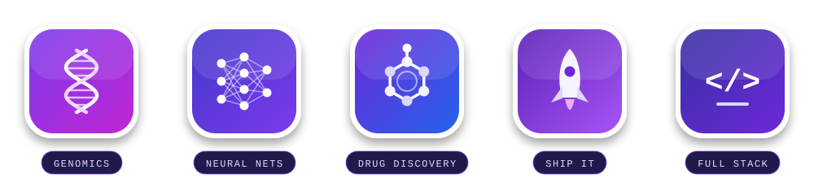

 

 

 

**Languages** 

**Frontend** 

**Backend and Databases** 

**Cloud, DevOps and Tooling** 

 

 

| Domain | Level | Details |
| :-- | :-: | :-- |
| Computational Biology |  | 16S rRNA and shotgun metagenomics, MAG pipelines, longitudinal statistics, Snakemake |
| Machine Learning |  | scikit-learn, XGBoost, grouped and scaffold-split validation, SHAP, calibration |
| Cheminformatics |  | RDKit descriptors, Morgan fingerprints, Murcko scaffolds, ADMET and target activity |
| Deep Learning and Imaging |  | PyTorch, CNN and ViT, MC Dropout, Grad-CAM, temperature scaling |
| LLM Systems and RAG |  | Hybrid BM25 and dense retrieval, RRF, grounded citations, refusal guardrails |
| AI Evaluation |  | LLM-as-judge rubrics, groundedness checks, regression gates, cost and latency tracking |
| MLOps and Serving |  | FastAPI, Docker, MLflow, GitHub Actions, CodeQL, Dependabot |

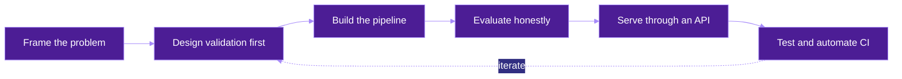

Every project below ships with tests, documented limitations and measurable evaluation.

 


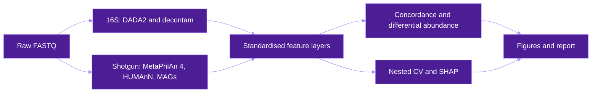

Snakemake 8 workflow with subject-grouped nested cross-validation, training-fold-only preprocessing, a label-permutation negative control and a synthetic cohort with planted signals for truth recovery.

 

  


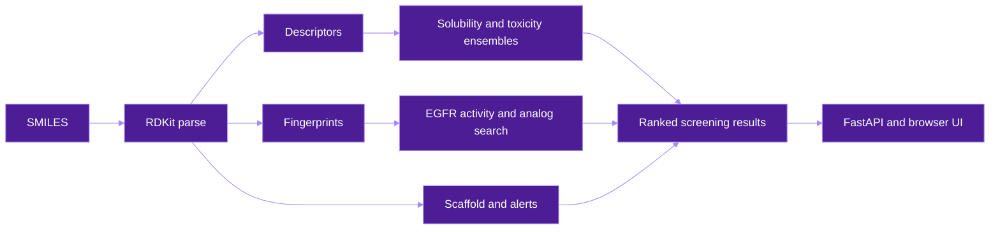

Scaffold-split evaluation with zero scaffold overlap, Lipinski, Veber and PAINS filters, a layered FastAPI backend and a Dockerised service with a healthcheck.

 

  


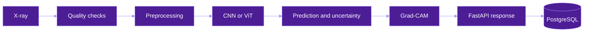

Patient-level splits to prevent leakage, temperature-scaling calibration, explanation faithfulness testing, MLflow tracking and a Docker Compose deployment.

 

  


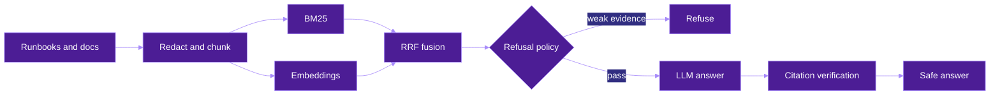

Unsupported questions are refused before any LLM call, fabricated citations count as safety failures, and a golden dataset gates recall, refusal correctness and groundedness in CI.

 

  


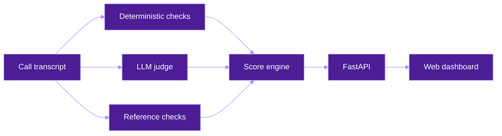

Figures come from the repository's synthetic 30-call regression benchmark, not production traffic.

 

  

 


  

 

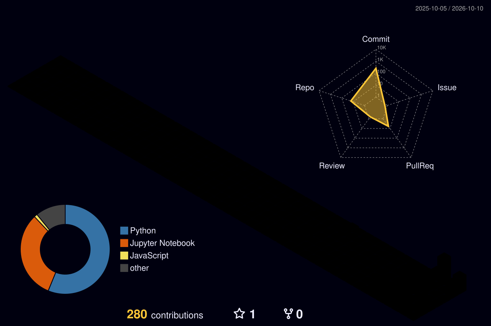

 

 

<picture>
  <source media="(prefers-color-scheme: dark)" srcset="https://raw.githubusercontent.com/Rollins1989/Rollins1989/output/github-snake-dark.svg" />
  <source media="(prefers-color-scheme: light)" srcset="https://raw.githubusercontent.com/Rollins1989/Rollins1989/output/github-snake.svg" />
  
</picture>

 

 

  

<i>Build systems that explain themselves, and measure everything that matters.</i>

